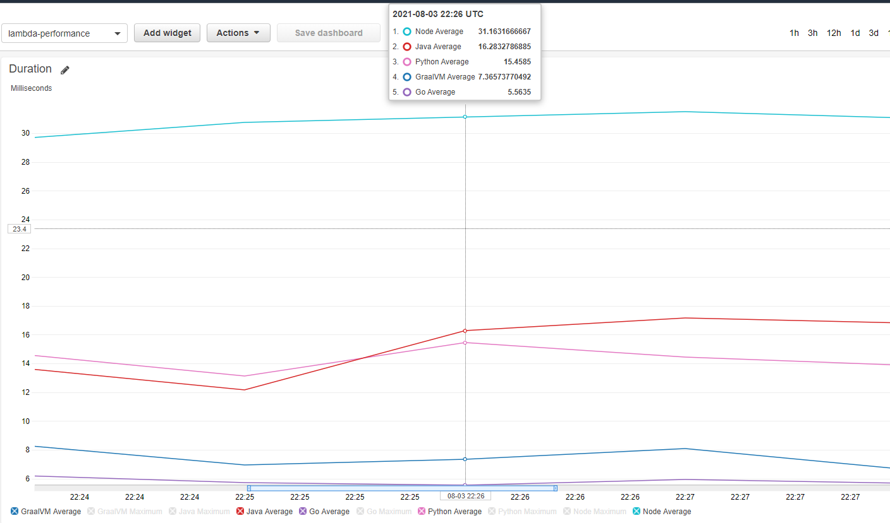

# AWS Lambda with Custom Runtime and GraalVM

**Here you can see 6 implementations of the microservice:**


- Java V1 - is the first Java implementation without optimisations
- Java V2 - is the optimised Java version
- Java V3 - is a GraalVM Lambda implementation  
- Go-lambda - is a Go implementation
- Node-lambda - is a NodeJs implementation
- Python-lambda - is a Python implementation

# Build and deploy

**Requirements:**

- Docker
- Maven 
- Java 11
- NPM
- Golang
- SAM

_to deploy the service just run:_
```sh
sh build.sh
```
# Performance result:
Cold start


Warmed up (256Mb Lambda, 10000 iterations for the 1 lambda)
